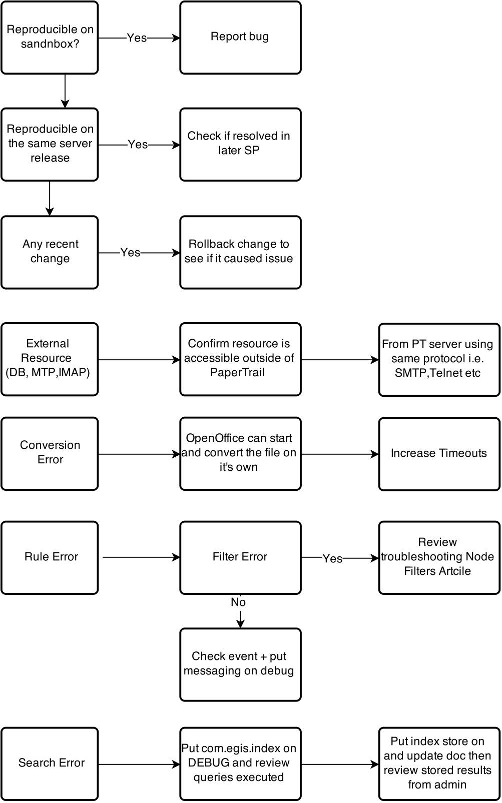

# Troubleshooting Server

## Isolate the Problem


## Solve the Problem 

*  Start with the client and release.  
*  Ensure that all the steps are followed.  
*  Include any information used in troubleshooting logs, release testing etc that may help identifying the issue.  
*  Any error must be accompanied by the corresponding log entry.  
*  Check the knowledge base first.  
*  Ask for help in the Support Room only.  
*  Add knowledge base article.  

## Log Levels

To increase the log levels, navigate to  __Services -> Logging__ in PT Admin UI.  


*  Select the __appropriate log level__ and click __Update__.  
*  Select the log level: `TRACE = highest amount of information`, `ERROR = Lowest amount of info`.  
*  Select whether the increased logging level should remain after restart. It is recommended to not keep DEBUG and TRACE levels for extended period.  
*  Click __Update__. 

## Rebuilding Indexes

To rebuild all indexes, Navigate to __Services -> Tasks -> Indexing__  

*  Run a __Repair all indexes__ when the indexes are mostly complete and there is only some out of date data.  
*  Run a __Rebuild all indexes__, when there is no index data.  


## Debug Mode

To start PaperTrail in Debug Mode in Windows:   
*   Start the __console_debug.exe__ command line app.  
 
To start PaperTrail in Debug Mode in Linux:   
*   Add the following to the __run.sh__ just after the java command:   

```javascript
-Xdebug  
-Xrunjdwp:transport=dt_socket,address=8787,server=y,suspend=n  
// Ex : java -Xdebug -Xrunjdwp:transport=dt_socket,address=8787,server=y,suspend=n -Xms512m -Xmx512m -XX:MaxPermSize=196m -classpath $(echo ../build/*.jar ../libs/*.jar . | sed 's/ /:/g'):conf com.egis.Startup
```


## Running Jobs

Any long running job will be listed under **Services -> Jobs**. These include:  

*  Scheduled Rules.  
*  Index Repairs / Rebuilds.  
*  File Store Repairs.  
*  Database Backups / Restores.  

## Failure to Start

If PaperTrail fails to start, follow these steps :  

*   Check that __Java is installed__ and no other service is listening on the default port.  
*   Verify that the __database is up__ and __accepting connections from the configured user/password__.  
*   Verify that user, service run as user __has appropriate permissions to read and write to all directories__ in the installation directory.  
*   Review the log files under logs - specifically **error.log, output.log, server.log**.  

## Low Performance 

*  Check the **memory usage**. Take a snapshot and review the vminfo.txt file, the total GC time should be **below 1% of uptime**. If the total GC time is higher, it indicates that the **heap space should be increased**.  
*  If running on a **virtualization platform**, ensure the host has enough resources.  
*  Check to ensure that there is enough **IO capacity for the application**.  
*  Verify that **3rd party application** is not utilizing CPU, RAM and IO resources.  
*  Verify that the Database has **enough RAM and IO capacity**.  
*  Verify that **database indexes are created** and statistics are up to date.  
*  Review thread dump at [http://host:8080/snapshot/threads](http://host:8080/snapshot/threads) for threads with high CPU usage.  
*  Verify best practices.  

## Checking log files

*  Go to [http://host:8080/web/admin/log.html](http://host:8080/web/admin/log.html).  
*  Take a snapshot [http://host/snapshot](http://host/snapshot).  

## Rules debugging

If you expect some rule to be applied to created/updated/deleted document and it doesn't it's probably because that 
document doesn't get covered by rule's source conditions. 

To see if that's the case, set `com.egis.index.query` to DEBUG - see how in [Log Levels](#log-levels) section. 
Then you'll see the SQL queries and their result set counts in log console.
